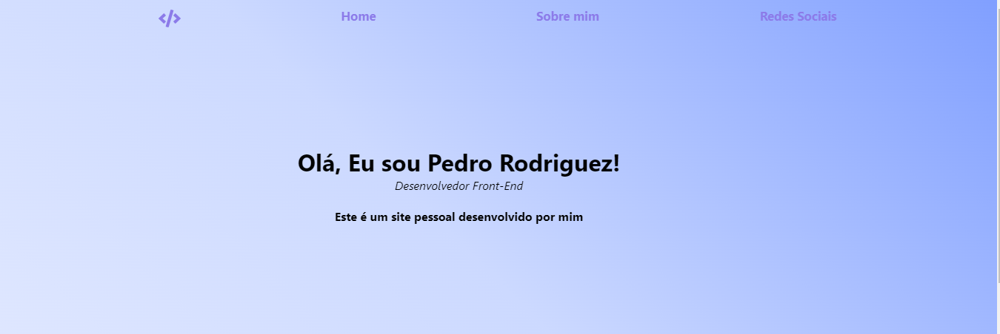
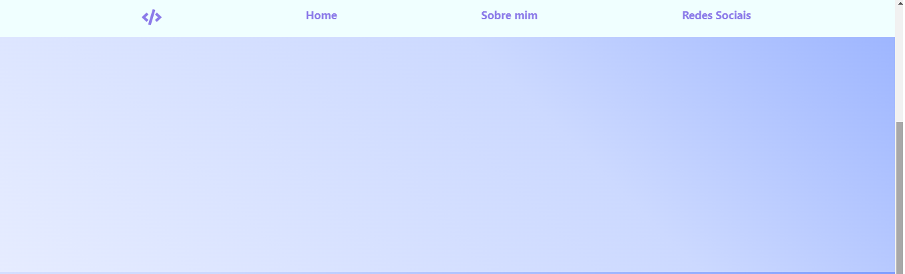
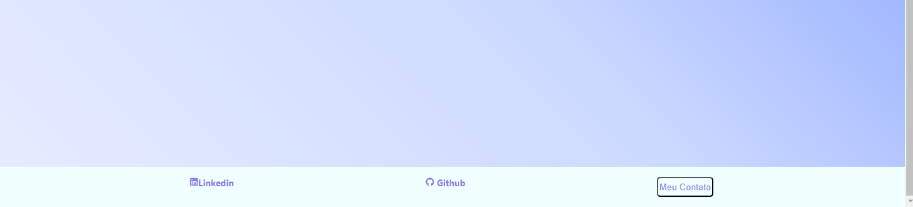

<h1>Site pessoal</h1>

Projeto desenvolvido por mim feito com React.js

<h1>Barra de navegação</h1>

Acompanha o scroll da tela

 

<h1>Footer</h1>

Footer com opçoes de contato e referência

Fiz este projeto como pratica do que venho estudando sobre react.js
utilizei componentes realizando a importação deles, estou bem animado com a aprendizagem de react e acho incrível a forma em quea página se molda.

